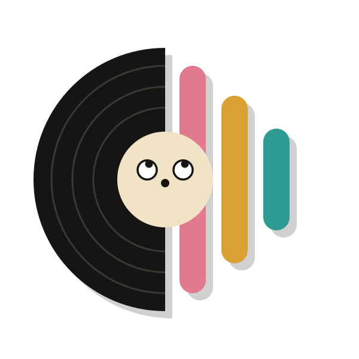
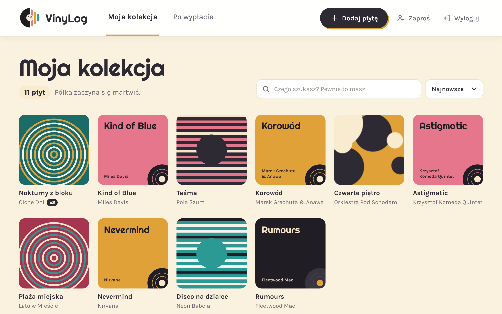
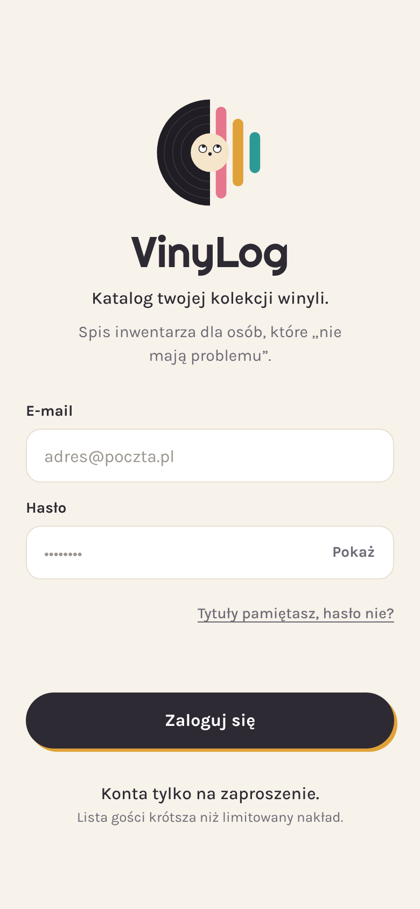
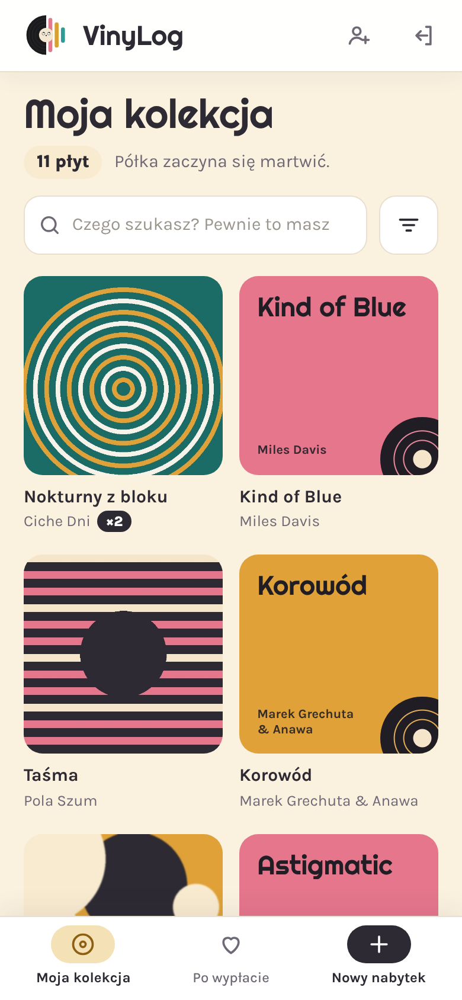
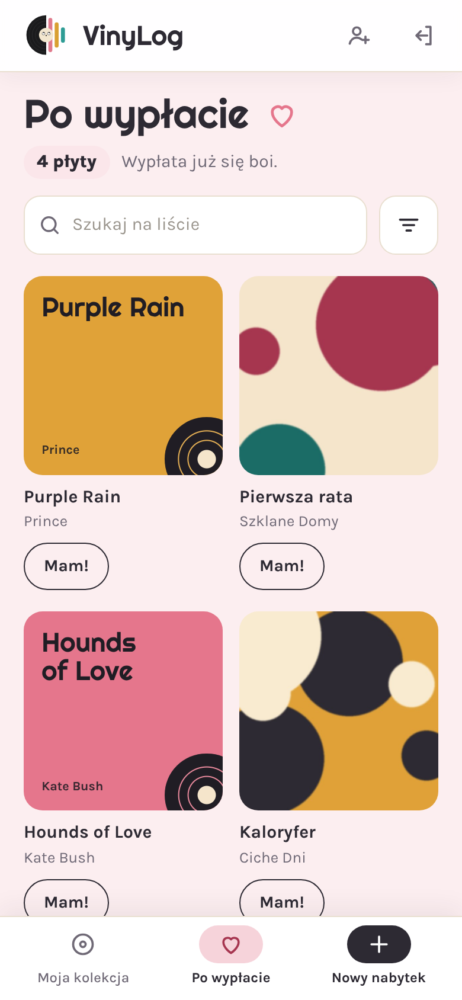
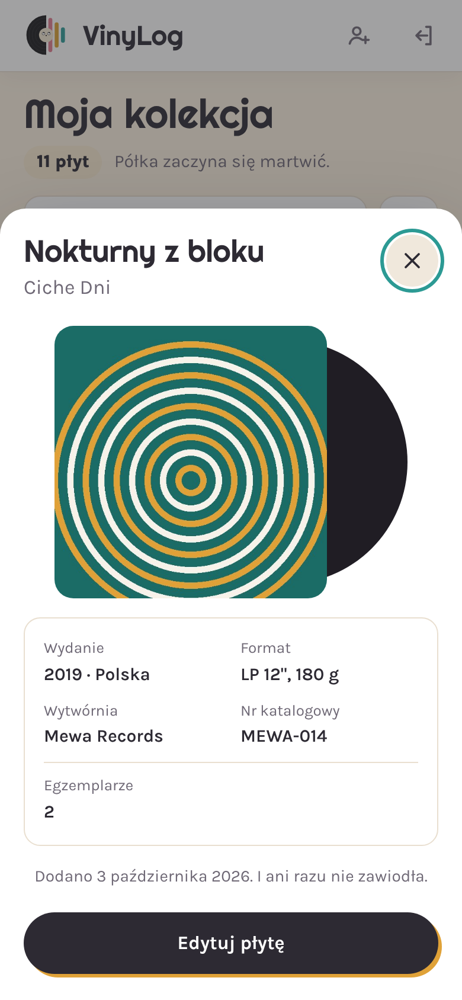
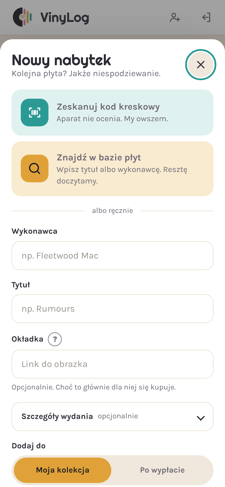
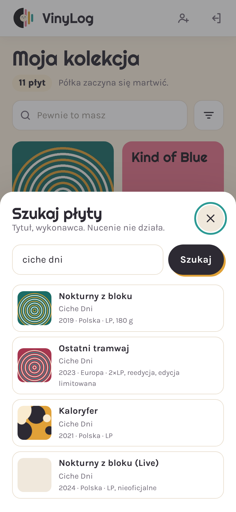
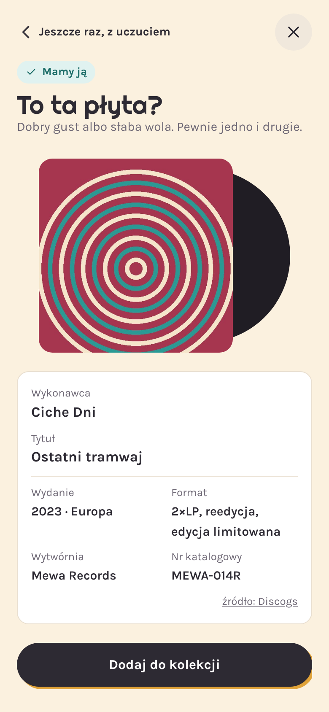

  

<h1 align="center">VinyLog</h1>

  Katalog kolekcji winyli. Z poczuciem humoru i bez litości dla portfela. 
  <a href="https://danusiowa.github.io/vinylog/"><b>danusiowa.github.io/vinylog</b></a>

---

## Wygląd

  

| Logowanie | Moja kolekcja | Po wypłacie | Karta płyty |
| :---: | :---: | :---: | :---: |
|  |  |  |  |
| **Nowy nabytek** | **Szukaj płyty** | **To ta płyta?** | |
|  |  |  | |

Zrzuty z przykładowymi danymi. Część zespołów i okładek jest zmyślona na potrzeby makiet. Płyty bez okładki dostają kolorową okładkę z tytułem, jak „Kind of Blue” wyżej.

## Co umie

- **Moja kolekcja** i **Po wypłacie** – płyty, które masz, i te, na które zbierasz. „Mam!” przenosi płytę z listy życzeń do kolekcji.
- **Trzy sposoby dodawania płyty:**
  - skan kodu kreskowego aparatem telefonu (tylko na telefonie i tablecie),
  - wyszukiwanie po tytule i wykonawcy,
  - ręcznie, jak za dawnych lat.
- **Dane wydania same się uzupełniają:** rok, kraj, wytwórnia, numer katalogowy, format i okładka. Najpierw z [Discogs](https://www.discogs.com/), a gdy tam nic nie ma, z [MusicBrainz](https://musicbrainz.org/) i [Cover Art Archive](https://coverartarchive.org/). Dane z obu źródeł są ujednolicone.
- **Własne kopie okładek** w Supabase Storage, zmniejszone do 800 px. Nie znikną, gdy źródło usunie obrazek.
- **Egzemplarze i duplikaty:** ta sama płyta drugi raz to „+1 egzemplarz” zamiast nowego wpisu.
- **Karta płyty** ze szczegółami wydania, wyszukiwarka, sortowanie.
- **Zaproszenia linkiem:** każda zalogowana osoba może zaprosić kolejną. Link wysyła się czymkolwiek, na przykład WhatsAppem albo SMS-em.
- **Instalacja na telefonie** (PWA): ikona na ekranie, pełny ekran bez paska przeglądarki. Android: menu ⋮ → „Zainstaluj aplikację”, iPhone (Safari): Udostępnij → „Do ekranu początkowego”. Nowe wersje wczytują się same.
- **Każdy widzi tylko swoje płyty** – pilnują tego polityki RLS w bazie.

## Jak to jest zbudowane

| Część | Technologia |
| --- | --- |
| Aplikacja | Jeden plik [`index.html`](index.html): HTML, CSS i czysty JavaScript, bez budowania |
| Hosting | GitHub Pages z gałęzi `main` |
| Logowanie i baza | [Supabase](https://supabase.com/): Auth, Postgres z RLS, Storage |
| Logika po stronie serwera | Supabase Edge Functions w [`supabase/functions`](supabase/functions) |
| Skaner kodów | [ZXing](https://github.com/zxing-js/library), ładowany dopiero przy skanowaniu |
| Czcionki | Righteous i Karla z Google Fonts |

Edge Functions:

| Funkcja | Do czego |
| --- | --- |
| `discogs-barcode` | Szuka w Discogs po kodzie kreskowym albo po tekście. Token Discogs zostaje na serwerze |
| `cover-copy` | Kopiuje okładkę spod linku do magazynu `covers` |
| `invite-link` | Tworzy link z zaproszeniem do aplikacji |

Wszystkie teksty interfejsu są w obiekcie `COPY` w `index.html`, a ustawienia w obiekcie `CONFIG`.

## Własna instalacja

1. **Supabase:** załóż projekt.
2. **Baza:** w SQL Editor uruchom po kolei pliki z [`supabase/migrations`](supabase/migrations), od `00` do `04`. W `01` wpisz swój e-mail.
3. **Logowanie:** w Authentication:
   - ustaw Site URL i Redirect URLs na adres aplikacji,
   - wyłącz „Allow new users to sign up” (konta powstają tylko z zaproszenia),
   - opcjonalnie ustaw „Email OTP Expiration” na `86400`, żeby link z zaproszeniem działał 24 godziny.
4. **Edge Functions:** utwórz trzy funkcje z [`supabase/functions`](supabase/functions):
   - przy każdej wyłącz „Verify JWT” (funkcje same sprawdzają, kto pyta),
   - w Secrets dodaj `DISCOGS_TOKEN` (token z [Discogs → Developers](https://www.discogs.com/settings/developers)),
   - w `invite-link` i pozostałych funkcjach podmień `APP_URL`, `ALLOWED_ORIGINS` i `ADMIN_EMAILS` na swoje.
5. **Aplikacja:** w `index.html` w `CONFIG` wpisz swoje `SUPABASE_URL` i `SUPABASE_KEY` (klucz *publishable*, można go trzymać w repozytorium).
6. **Hosting:** wrzuć repozytorium na GitHub i włącz Pages z gałęzi `main`. Pierwsze konto dodaj ręcznie w Supabase (Authentication → Users → Invite), kolejne osoby zapraszaj już z aplikacji.

## Praca z repozytorium

- Zmiany w `index.html` są widoczne w aplikacji 1–2 minuty po wypchnięciu na `main`.
- Zmiany w Edge Functions trzeba wdrożyć osobno w panelu Supabase.
- Nowa kolumna w bazie to nowa migracja w `supabase/migrations`, uruchomiona **przed** wypchnięciem kodu, który z niej korzysta.
